# Matplotlib Study Notes


```python
import numpy as np
import pandas as pd
import matplotlib.pyplot as plt

plt.style.use('seaborn-deep')
%matplotlib inline
```

Many styles are available in `matplotlib`. The style names are printed as follow. Popular styles include `seaborn-deep`, `seaborn-whitegrid`, `fivethirtyeight` and `ggplot2`.


```python
plt.style.available
```


    ['bmh',
     'classic',
     'dark_background',
     'fast',
     'fivethirtyeight',
     'ggplot',
     'grayscale',
     'seaborn-bright',
     'seaborn-colorblind',
     'seaborn-dark-palette',
     'seaborn-dark',
     'seaborn-darkgrid',
     'seaborn-deep',
     'seaborn-muted',
     'seaborn-notebook',
     'seaborn-paper',
     'seaborn-pastel',
     'seaborn-poster',
     'seaborn-talk',
     'seaborn-ticks',
     'seaborn-white',
     'seaborn-whitegrid',
     'seaborn',
     'Solarize_Light2',
     '_classic_test']


## Visualization

### Basic Plots

First we initialize samples from standard normal distribution.


```python
x = np.random.randn(100)
y = np.random.randn(100)
```

Then we imitate central limit theorem: random sampling and compute mean.


```python
sample_mean = np.zeros(10000)
for i in range(10000):
    t = np.random.randint(low=0, high=100, size=100)
    sample_mean[i] = np.mean(t)
```

#### Histogram and Scatter Plot


```python
plt.hist(sample_mean, bins=100)
plt.grid()
```


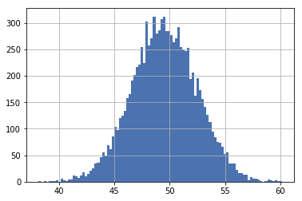


The most straightforward way to plot is to do it in sequential way.


```python
fig = plt.figure(figsize=(10, 12))
plt.subplot(2, 1, 1) # row, column, panel
plt.hist(sample_mean, bins=100, fill='#aad7ee', label='sample mean')
plt.grid()
plt.axis([35, 65, 0, 320])
plt.title("Distribution: Sample Mean")
plt.legend(loc='upper left', frameon=False)
plt.subplot(2, 1, 2)
plt.scatter(x, y, c=(49 * 1.0 / 255, 137 * 1.0 / 255, 242 * 1.0 / 255))
plt.xlim(-3, 3.5)
plt.ylim(-3, 3.5)
plt.title("Scatter: Random Sampling")
plt.grid()
```


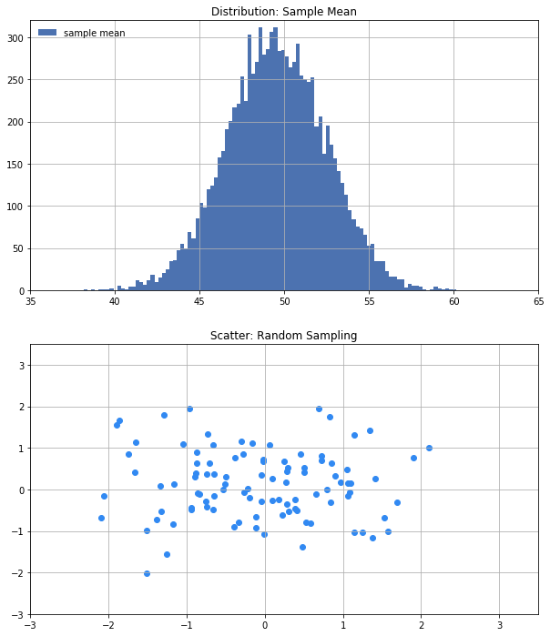


Another objective oriented way based on Axes object. Note that with Axes object, configuration is done through `ax.set()`.


```python
fig, ax = plt.subplots(2, figsize=(10, 12))
ax[0].scatter(x, y, c=(49 * 1.0 / 255, 137 * 1.0 / 255, 242 * 1.0 / 255))
ax[0].grid()
ax[0].set(xlim=(-3, 3.5), ylim=(-3, 3.5), xlabel='sample x', ylabel='sample y', title='Scatter: Random Sampling')
ax[1].hist(sample_mean, bins=100, color='#aad7ee')
ax[1].grid()
ax[1].set(xlim=(35, 65), ylim=(0, 320), title='Distribution: Sample Mean')
```


    [(0, 320), (35, 65), Text(0.5,1,'Distribution: Sample Mean')]


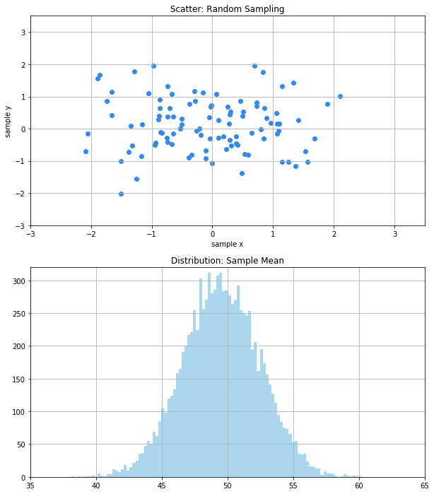


```python
color_map = np.random.rand(100) * 1000

plt.figure(figsize=(10, 8))
plt.scatter(x, y, c=color_map, cmap='viridis', s=color_map, alpha=0.3)
plt.axis([-3.5, 3.5, -3.5, 3.5])
plt.colorbar()
```


    <matplotlib.colorbar.Colorbar at 0x19b5416ee48>


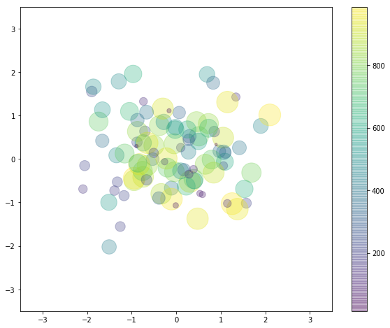


Scatter plot can be drawn through `plt.plot(x, y, marker='o')`. The major difference is that:
1. plt.plot is more efficient since it basically makes copy of marker each time plotting a data point onto canvas. However, it does limited support on color/size map.
2. plt.scatter has rich options but unfortunately it's generating one marker after another therefore not efficient.


```python
plt.figure(figsize=(10, 8))

xfit = np.linspace(-3, 3, 100)
noise = np.abs(np.random.normal(0, 0.03, 100))
yfit = 1.0 / (1 + (np.exp(-xfit)))


plt.errorbar(xfit, yfit, fmt='o', yerr=noise, ecolor='lightgray')
plt.fill_between(xfit, yfit - noise, yfit + noise, color='gray', alpha=0.3)
```


    <matplotlib.collections.PolyCollection at 0x19b541572b0>


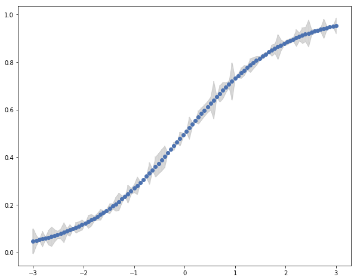


### Plots for Visualizing 3D / 2D Data

#### Contour Plot


```python
f = lambda x, y: np.sin(x) ** 10 + np.cos(x * y + 10) * np.cos(x)
```


```python
x1 = np.linspace(0, 5, 50)
y1 = np.linspace(0, 5, 50)

X, Y = np.meshgrid(x1, y1)

Z = f(X, Y)
```


```python
plt.contourf(X, Y, Z, 20, cmap='viridis')
plt.colorbar()
```


    <matplotlib.colorbar.Colorbar at 0x19b544c2588>


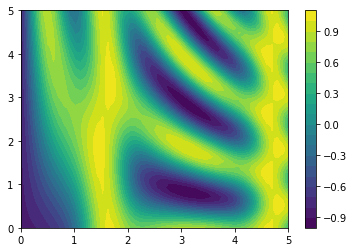


```python
plt.imshow(Z, extent=[0, 5, 0, 5], origin='lower', cmap='viridis')
plt.colorbar()
plt.axis(aspect = 'image')
```


    (0.0, 5.0, 0.0, 5.0)


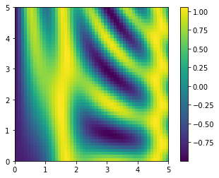


```python
contours = plt.contour(X, Y, Z, 10, cmap='viridis')
plt.clabel(contours, inline=True, fontsize=8)
plt.imshow(Z, extent=[0, 5, 0, 5], origin='lower', cmap='viridis', alpha=0.5)
plt.colorbar()
```


    <matplotlib.colorbar.Colorbar at 0x19b54679f98>


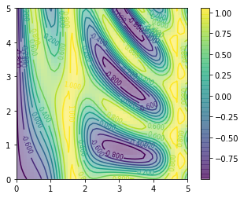


#### 2D Histogram


```python
plt.hist2d(x, y, bins=50, cmap='BuGn')
plt.colorbar()
```


    <matplotlib.colorbar.Colorbar at 0x19b5450b9b0>


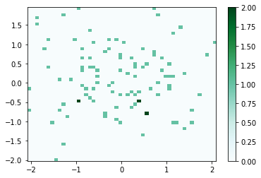


```python
plt.hexbin(x, y, gridsize=30, cmap='BuGn')
plt.colorbar()
```


    <matplotlib.colorbar.Colorbar at 0x19b53db6a20>


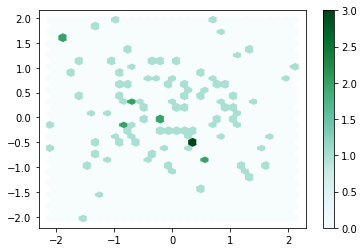


```python
fig, ax = plt.subplots()
h2 = ax.hist2d(x, y, bins=50, cmap='Blues')
```


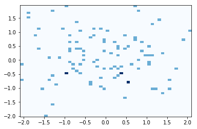


```python
mean = [0, 0]
cov = [[1, 1], [1, 2]]
x2, y2 = np.random.multivariate_normal(mean, cov, 1000).T
X2, Y2 = np.meshgrid(x2, y2)

Z2 = f(X2, Y2)
```


```python
plt.hist2d(x2, y2, bins=50, cmap=plt.cm.get_cmap('Blues', 6))
plt.colorbar()
```


    <matplotlib.colorbar.Colorbar at 0x19b53ceecf8>


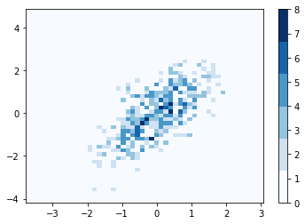


```python
fig = plt.figure(figsize=(10, 8))
grid = plt.GridSpec(4, 4, hspace=0.2, wspace=0.2)
main_ax = fig.add_subplot(grid[:-1, 1:])
y_hist = fig.add_subplot(grid[:-1, 0], xticklabels=[], sharey=main_ax)
y_hist.grid()
x_hist = fig.add_subplot(grid[-1, 1:], yticklabels=[], sharex=main_ax)
x_hist.grid()

main_ax.plot(x, y, 'o', alpha=0.3)
main_ax.grid()

x_hist.hist(x, bins=50, orientation='vertical')
x_hist.invert_yaxis()

y_hist.hist(y, bins=50, orientation='horizontal')
y_hist.invert_xaxis()
```


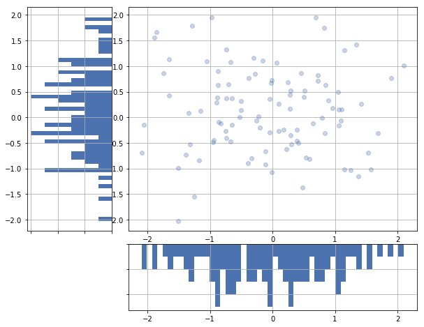

